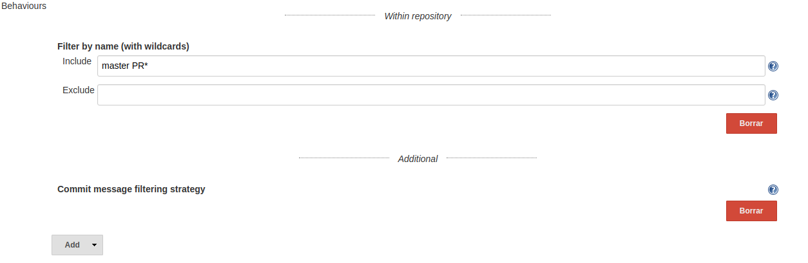

# Bitbucket Commit Skip SCM Behaviour

## Description

This plugin extends the filtering abilities of the [Bitbucket Branch Source Plugin](https://plugins.jenkins.io/cloudbees-bitbucket-branch-source/).
This filter ignores events when the source branch last commit contains the tags `[skip ci]` or `[ci skip]`.
The filtering is only performed for change request events, so push events to non-pull requests will be always run.

## Warning!

The current implementation tags the relevant pull request job as excluded.
This way, the job will be disabled (won't be executable via the UI) and might be erased if an orphaned child policy kicks in, losing the whole PR run history.

## Usage

When defining a new Bitbucket Team/Project, include an additional behaviour (placed under the "Additional" separator).

This behaviour is not configurable.
It will just show a simple inline help icon:

